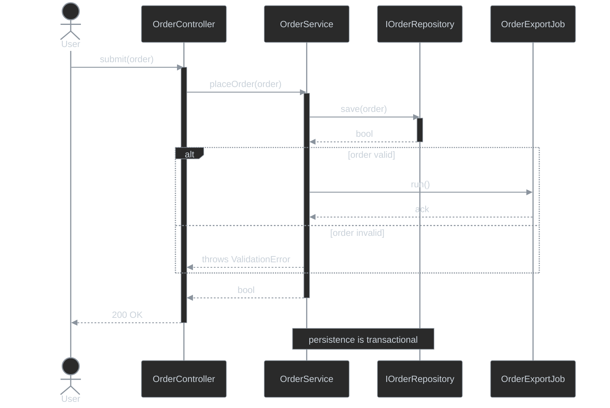
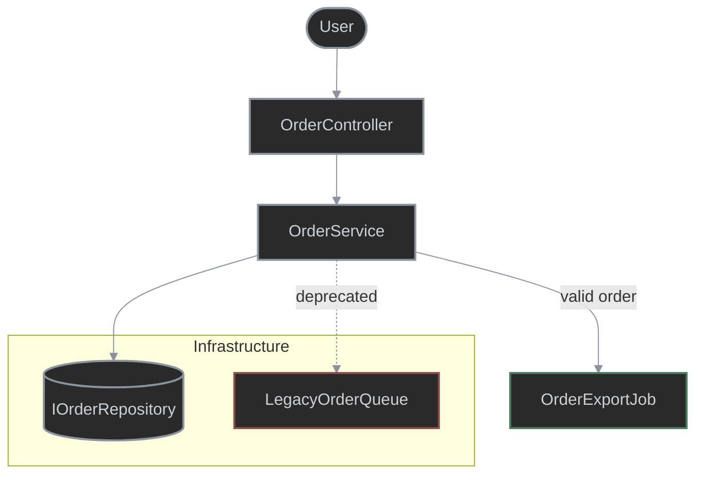

# Mermaid Class Diagram Styles (Dark Theme)

Source: [mermaid.ai — Class diagrams, Styling / Classes / Define Namespace](https://mermaid.ai/open-source/syntax/classDiagram.html). Colors are tuned for a dark rendering background (dark fill, light text, saturated stroke) rather than the light-theme defaults in the upstream docs.

## Class Diagrams

#### Classes

`classDef default fill:...` defines a **class of styles** applied to every node that has no explicit `:::name`, instead of repeating a `style NodeId fill:...` line per node. Attach a different class to any one node with the `:::name` shorthand, or the quoted form `cssClass "NodeId" name` when the id needs quoting.

## Notes

- Member visibility markers: `+` public (`OrderController.submit`), `-` private (`OrderService.repository`), `#` protected (`BaseController.logger`), `~` internal/package (`OrderService.cache`). A trailing `$` marks a member static (`OrderService.getInstance()$`).
- `classDef`/`:::` only styles whole classes, not individual members — there's no per-line color selector. To flag a single added/deleted field or method inside an otherwise-unstyled class, prefix its name with literal `[add]`/`[rem]` text, e.g. `+[add] getTax() decimal` (`OrderLineItem`) and `-[rem] legacyConnectionString : string` (`SqlOrderRepository`).
- Border style tells added/deleted apart at the class level: a **solid** green (`added`) or red (`removed`) border marks a class that is *entirely* new or deleted (`OrderExportJob`, `LegacyOrderQueue`); a **dashed gray** border (`memberChanged`) marks a class that only has an `[add]`/`[rem]` *member* inside it (`OrderLineItem`, `SqlOrderRepository`) — the class itself isn't new or removed, so it keeps the default gray color.
- Namespaces (`namespace Name { ... }`) group classes visually and logically; they cannot be styled directly with `style`/`classDef` — only the classes inside them can.
- Relationship arrows are not `classDef`-able (`linkStyle`, which works in flowcharts, raises a parse error in `classDiagram`). Set arrow/line color for the whole diagram via the `%%{init: {'themeVariables': {'lineColor': '#8b949e'}}}%%` directive on the first line, before `classDiagram` — verified against `mmdc` 11.16.0. `#8b949e` matches the `classDef default` stroke so arrows blend with the class borders instead of standing out as an unrelated accent color.
- **Inheritance** (`--|>`): the child class carries the same operations/attributes as its parent plus its own extras. `OrderController --|> BaseController`.
- **Aggregation** (`o--`): the container holds instances of another class, but those instances outlive the container — hollow diamond at the container. `OrderService o-- IOrderRepository`. Used for scoped/singleton dependencies injected via DI, since the DI container controls their lifetime.
- **Dependency** (`..>`): a dashed line — changes in one class ripple into another without an ownership relationship. `OrderController ..> OrderService`.
- **Interface implementation** (`..|>`): a class implements an interface. `SqlOrderRepository ..|> IOrderRepository`. The class name (`I`-prefix) already signals the role — no `<<Interface>>`/`<<Abstract>>` stereotype text is added.
- **Composition** (`*--`): like aggregation, but the contained instances are deleted along with the container — solid diamond at the container. `OrderController *-- OrderLineItem`. Used for transient dependencies injected via DI (the DI container controls their lifetime), and for instances created with `new` inside the container class.
- `note for ClassName "..."` attaches a free-text note to one class (`OrderService` above) — useful for a short explanation that doesn't belong in the class body.
- `classDef added`/`classDef removed` only override `stroke`, so the change status shows as a green or red **border** on top of the same gray fill/text as every other class. Colors are deliberately muted (`#4a7a5a`, `#8a4a4a`) rather than saturated, to stay legible without drawing more attention than the class names themselves.

## Sequence Diagrams

Source: [mermaid.ai — Sequence diagrams](https://mermaid.ai/open-source/syntax/sequenceDiagram.html).

#### Notes

- `actor`/`participant` both declare a lifeline; `actor` renders as a stick figure and is reserved for the human/external initiator (`User`), while `participant` renders as a box and is used for system components. The `as` alias (`participant Api as OrderController`) keeps arrow lines short while still labeling the box with the real class name.
- Solid arrow with filled head (`->>`) is a synchronous call/request; dashed arrow with filled head (`-->>`) is the matching return/response. Pair every `->>` with a `-->>` from the same target so the diagram reads as request/response, not fire-and-forget.
- `activate`/`deactivate` (or the `+`/`-` shorthand on the arrow, e.g. `Api->>+Svc:`) draws the vertical activation bar showing how long a participant is doing work — nest them to show a call chain still on the stack (`Api` stays active while it waits on `Svc`, which stays active while it waits on `Repo`).
- `alt`/`else`/`end` branches the diagram for mutually exclusive outcomes (validation success vs. failure) — same semantics as an `if/else`, rendered as a labeled box split by a dashed line. Use `opt`/`end` instead when there's only one conditional branch with no alternative.
- `note over A,B: text` spans a free-text note across two lifelines (`Svc` and `Repo`) to call out a cross-cutting concern (transactionality) that doesn't belong on a single arrow.
- Sequence diagrams have no `classDef`/`:::` styling mechanism, so matching the class diagram's dark palette requires per-property `themeVariables` instead: `actorBkg`/`labelBoxBkgColor`/`noteBkgColor`/`activationBkgColor` all use the same `#2a2a2a` fill, `actorBorder`/`labelBoxBorderColor`/`noteBorderColor`/`activationBorderColor`/`signalColor` all use the same `#8b949e` stroke, and `actorTextColor`/`labelTextColor`/`noteTextColor`/`signalTextColor`/`loopTextColor`/`sequenceNumberColor` all use the same `#c9d1d9` text color as `classDef default` in the class diagram.
- `lineColor` is kept alongside the new variables for consistency with the class/flowchart diagrams, though `signalColor` is what actually controls arrow color in a sequence diagram.

## Block Diagrams (Flowcharts)

Source: [mermaid.ai — Flowcharts](https://mermaid.ai/open-source/syntax/flowchart.html).

#### Notes

- Node shape signals role, not just style: `(["..."])` stadium shape for an external actor (`User`), plain `["..."]` rectangle for a process/component (`Api`, `Svc`), and `[("...")]` cylinder for a data store/repository (`Repo`) — matching the ER-diagram convention of "cylinder = storage".
- `flowchart TD` lays the graph out top-down; `flowchart LR` (left-to-right) reads better for pipelines with many parallel branches. Pick the direction that keeps the diagram narrower than it is tall (or vice versa) for the surrounding page layout.
- Solid arrow (`-->`) is the default/normal flow edge; a labeled solid arrow (`-- text -->`) documents the condition under which that edge is taken (`Svc -- valid order --> Queue`); a dotted arrow (`-.text.->`) marks a deprecated or exceptional path (`Svc -. deprecated .-> Legacy`) — same visual vocabulary as dashed vs. solid relationship lines in the class diagram.
- `subgraph Name ... end` groups existing nodes into a labeled box without redeclaring them — same purpose as `namespace` in class diagrams, but flowchart `subgraph`s can also be targets of edges (an arrow can point at the whole box instead of one node inside it).
- `classDef`/`:::` styling works identically to class diagrams here: `added`/`removed` classes reuse the same muted green/red stroke convention to flag new (`Queue`) or deleted (`Legacy`) nodes at a glance.
- The same dark-theme `classDef default` and `%%{init: ...}%%` line-color directive are reused verbatim from the class-diagram section so all three diagram types render consistently on a dark background.
