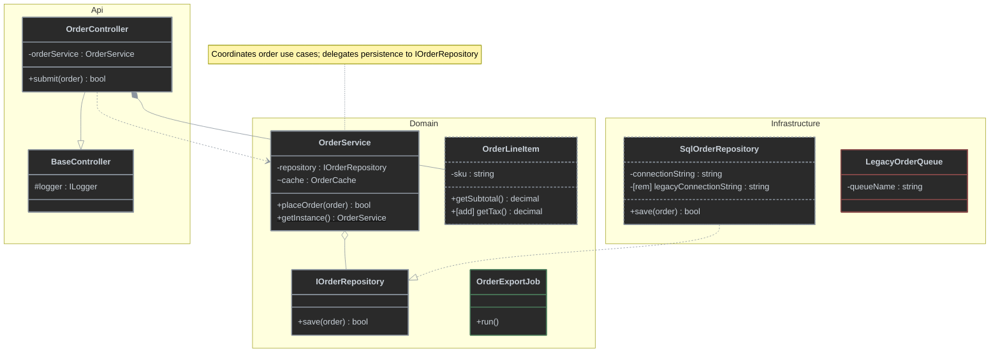

# Mermaid Class Diagram Styles (Dark Theme)

Source: [mermaid.ai — Class diagrams, Styling / Classes / Define Namespace](https://mermaid.ai/open-source/syntax/classDiagram.html). Colors are tuned for a dark rendering background (dark fill, light text, saturated stroke) rather than the light-theme defaults in the upstream docs.

## Class Diagrams

#### Classes

`classDef default fill:...` defines a **class of styles** applied to every node that has no explicit `:::name`, instead of repeating a `style NodeId fill:...` line per node. Attach a different class to any one node with the `:::name` shorthand, or the quoted form `cssClass "NodeId" name` when the id needs quoting.

## Notes

- Member visibility markers: `+` public (`OrderController.submit`), `-` private (`OrderService.repository`), `#` protected (`BaseController.logger`), `~` internal/package (`OrderService.cache`). A trailing `$` marks a member static (`OrderService.getInstance()$`).
- `classDef`/`:::` only styles whole classes, not individual members — there's no per-line color selector. To flag a single added/deleted field or method inside an otherwise-unstyled class, prefix its name with literal `[add]`/`[rem]` text, e.g. `+[add] getTax() decimal` (`OrderLineItem`) and `-[rem] legacyConnectionString : string` (`SqlOrderRepository`).
- Border style tells added/deleted apart at the class level: a **solid** green (`added`) or red (`removed`) border marks a class that is *entirely* new or deleted (`OrderExportJob`, `LegacyOrderQueue`); a **dashed gray** border (`memberChanged`) marks a class that only has an `[add]`/`[rem]` *member* inside it (`OrderLineItem`, `SqlOrderRepository`) — the class itself isn't new or removed, so it keeps the default gray color.
- Namespaces (`namespace Name { ... }`) group classes visually and logically; they cannot be styled directly with `style`/`classDef` — only the classes inside them can.
- Relationship arrows are not `classDef`-able (`linkStyle`, which works in flowcharts, raises a parse error in `classDiagram`). Set arrow/line color for the whole diagram via the `%%{init: {'themeVariables': {'lineColor': '#8b949e'}}}%%` directive on the first line, before `classDiagram` — verified against `mmdc` 11.16.0. `#8b949e` matches the `classDef default` stroke so arrows blend with the class borders instead of standing out as an unrelated accent color.
- **Inheritance** (`--|>`): the child class carries the same operations/attributes as its parent plus its own extras. `OrderController --|> BaseController`.
- **Aggregation** (`o--`): the container holds instances of another class, but those instances outlive the container — hollow diamond at the container. `OrderService o-- IOrderRepository`. Used for scoped/singleton dependencies injected via DI, since the DI container controls their lifetime.
- **Dependency** (`..>`): a dashed line — changes in one class ripple into another without an ownership relationship. `OrderController ..> OrderService`.
- **Interface implementation** (`..|>`): a class implements an interface. `SqlOrderRepository ..|> IOrderRepository`. The class name (`I`-prefix) already signals the role — no `<<Interface>>`/`<<Abstract>>` stereotype text is added.
- **Composition** (`*--`): like aggregation, but the contained instances are deleted along with the container — solid diamond at the container. `OrderController *-- OrderLineItem`. Used for transient dependencies injected via DI (the DI container controls their lifetime), and for instances created with `new` inside the container class.
- `note for ClassName "..."` attaches a free-text note to one class (`OrderService` above) — useful for a short explanation that doesn't belong in the class body.
- `classDef added`/`classDef removed` only override `stroke`, so the change status shows as a green or red **border** on top of the same gray fill/text as every other class. Colors are deliberately muted (`#4a7a5a`, `#8a4a4a`) rather than saturated, to stay legible without drawing more attention than the class names themselves.
